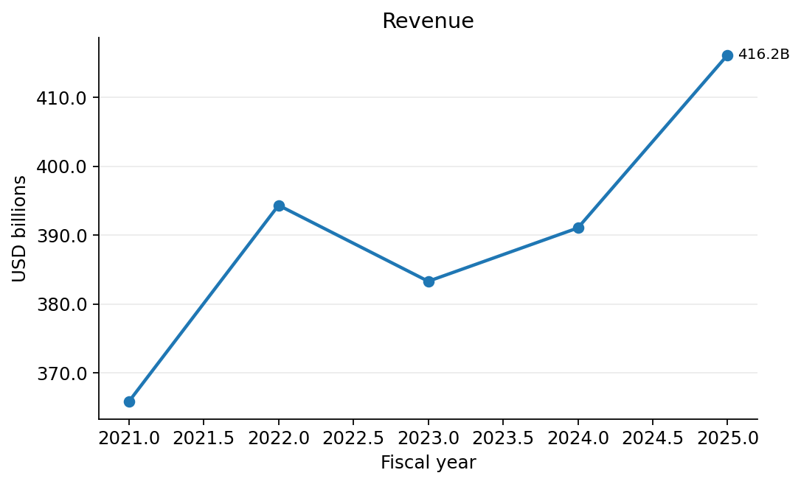
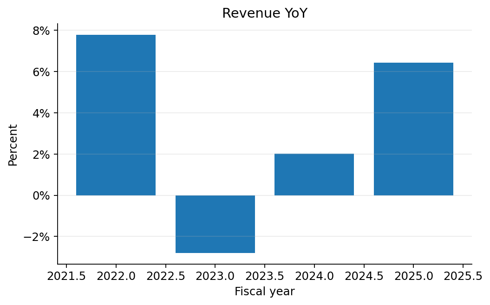
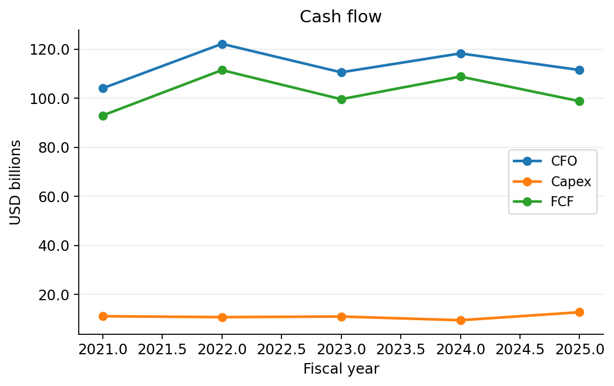
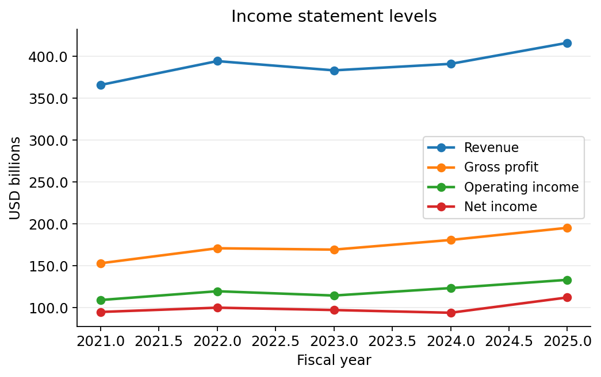
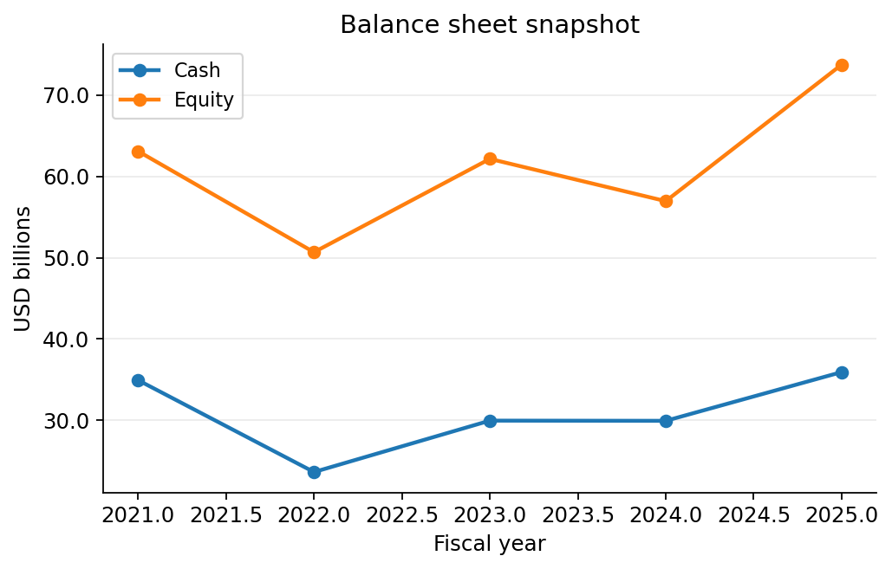
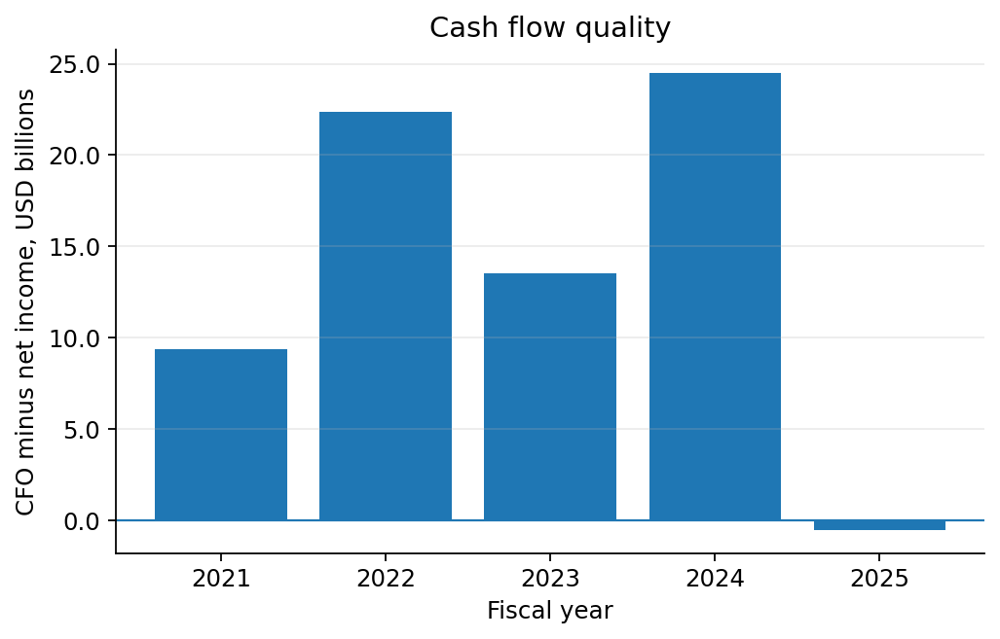
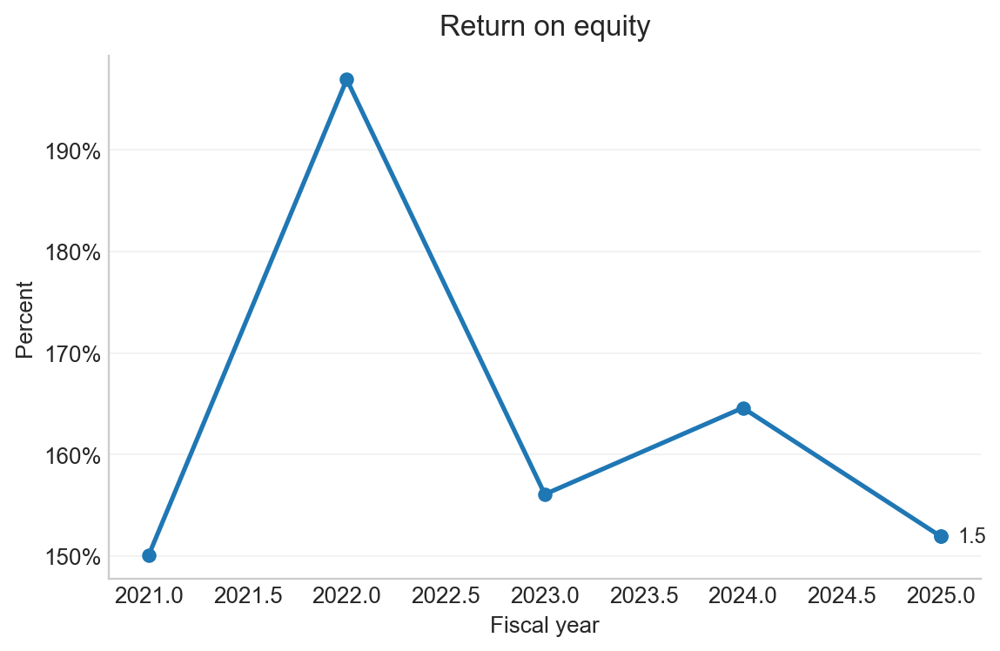

# Apple Inc. - AAPL Automated Financial Analysis Report

- CIK: `0000320193`
- Generated: 2026-01-11 23:41:04
- Coverage: last 5 fiscal years

## Highlights
- Latest fiscal year: **FY2025** ended 2025-09-27.
- Revenue: **416.2B** and 6.4% YoY.
- Gross margin: **46.9%**.
- Operating margin: **32.0%**.
- Net margin: **26.9%**.
- Free cash flow: **98.8B** and 23.7% of revenue.
- Revenue increased vs prior year.

## Charts

| | |
|---|---|
| <b>Revenue</b>  | <b>Revenue YoY</b>  |
| <b>Margins</b>  | <b>Cash flow</b>  |
| <b>Income statement levels</b>  | <b>Balance sheet snapshot</b>  |
| <b>Cash flow quality</b>  | <b>Return on equity</b>  |

## Annual Financials Table
USD in billions for level metrics
|   fy | fiscal_year_end   |   revenue |   gross_profit |   operating_income |   net_income |   cfo |   capex |   fcf | revenue_yoy   | gross_margin   | operating_margin   | net_margin   | fcf_margin   |   cash |   equity |
|-----:|:------------------|----------:|---------------:|-------------------:|-------------:|------:|--------:|------:|:--------------|:---------------|:-------------------|:-------------|:-------------|-------:|---------:|
| 2025 | 2025-09-27        |     416.2 |          195.2 |              133.1 |        112   | 111.5 |    12.7 |  98.8 | 6.4%          | 46.9%          | 32.0%              | 26.9%        | 23.7%        |   35.9 |     73.7 |
| 2024 | 2024-09-28        |     391   |          180.7 |              123.2 |         93.7 | 118.3 |     9.4 | 108.8 | 2.0%          | 46.2%          | 31.5%              | 24.0%        | 27.8%        |   29.9 |     57   |
| 2023 | 2023-09-30        |     383.3 |          169.1 |              114.3 |         97   | 110.5 |    11   |  99.6 | -2.8%         | 44.1%          | 29.8%              | 25.3%        | 26.0%        |   30   |     62.1 |
| 2022 | 2022-09-24        |     394.3 |          170.8 |              119.4 |         99.8 | 122.2 |    10.7 | 111.4 | 7.8%          | 43.3%          | 30.3%              | 25.3%        | 28.3%        |   23.6 |     50.7 |
| 2021 | 2021-09-25        |     365.8 |          152.8 |              108.9 |         94.7 | 104   |    11.1 |  93   | NA            | 41.8%          | 29.8%              | 25.9%        | 25.4%        |   34.9 |     63.1 |

## XBRL Concept Map

| Metric | XBRL Concept |
|---|---|
| revenue | `RevenueFromContractWithCustomerExcludingAssessedTax` |
| gross_profit | `GrossProfit` |
| operating_income | `OperatingIncomeLoss` |
| net_income | `NetIncomeLoss` |
| cfo | `NetCashProvidedByUsedInOperatingActivities` |
| capex | `PaymentsToAcquirePropertyPlantAndEquipment` |
| cash | `CashAndCashEquivalentsAtCarryingValue` |
| equity | `StockholdersEquity` |
