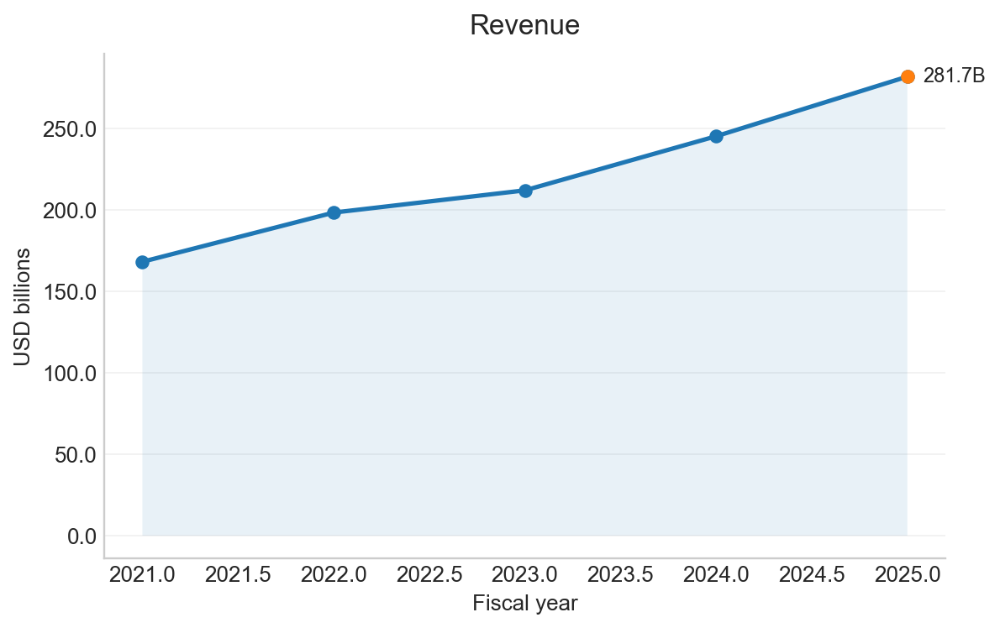
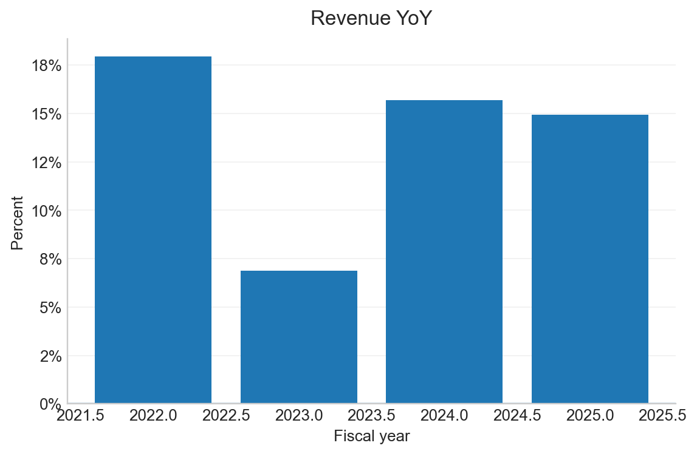
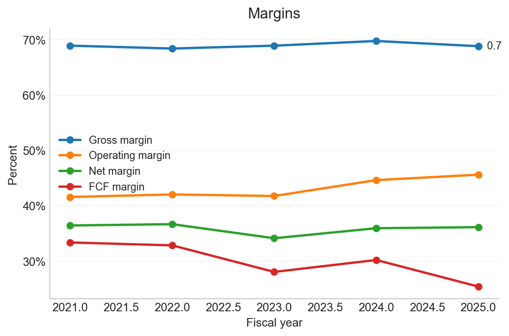
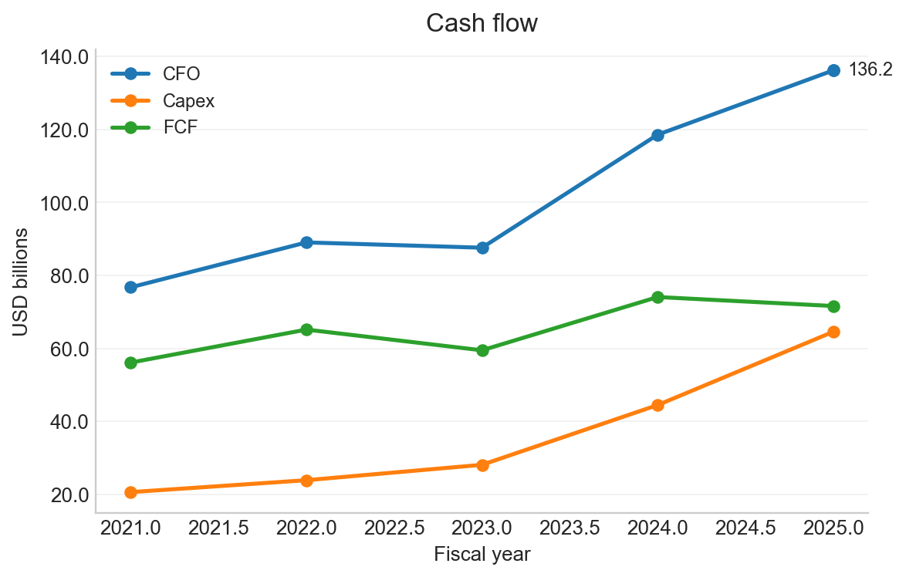
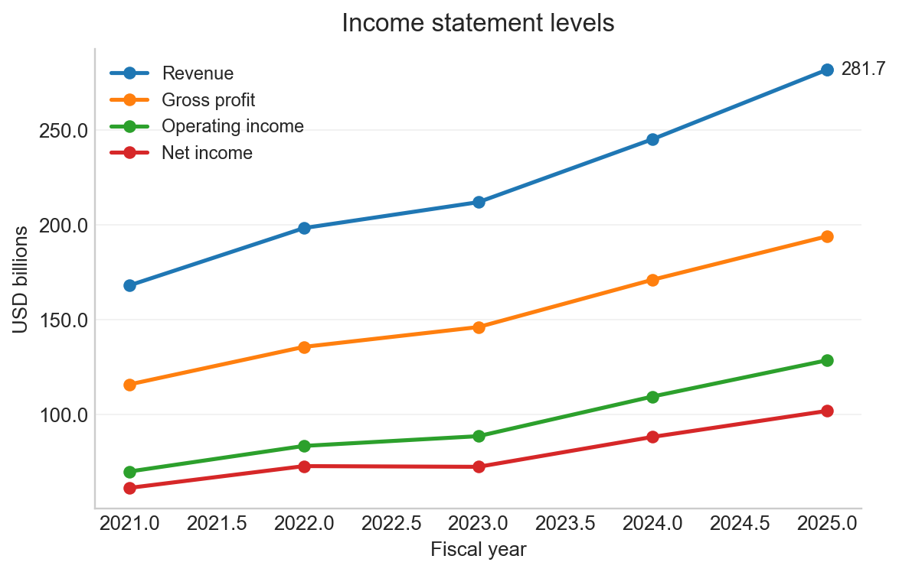
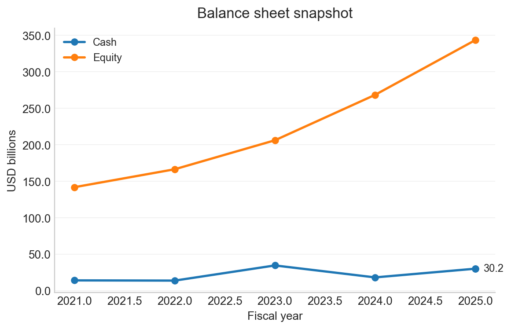
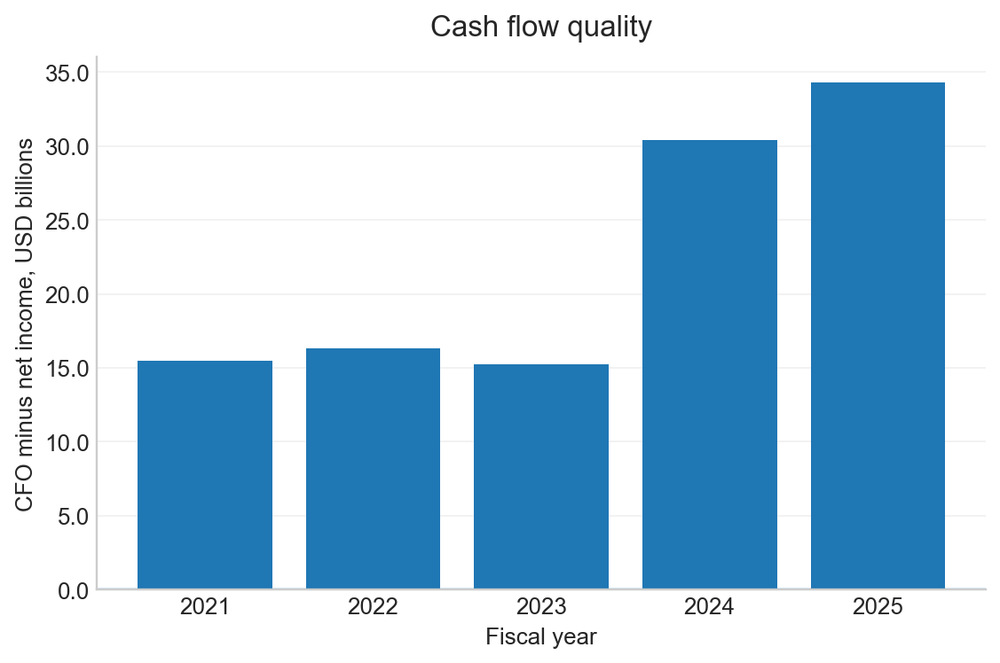
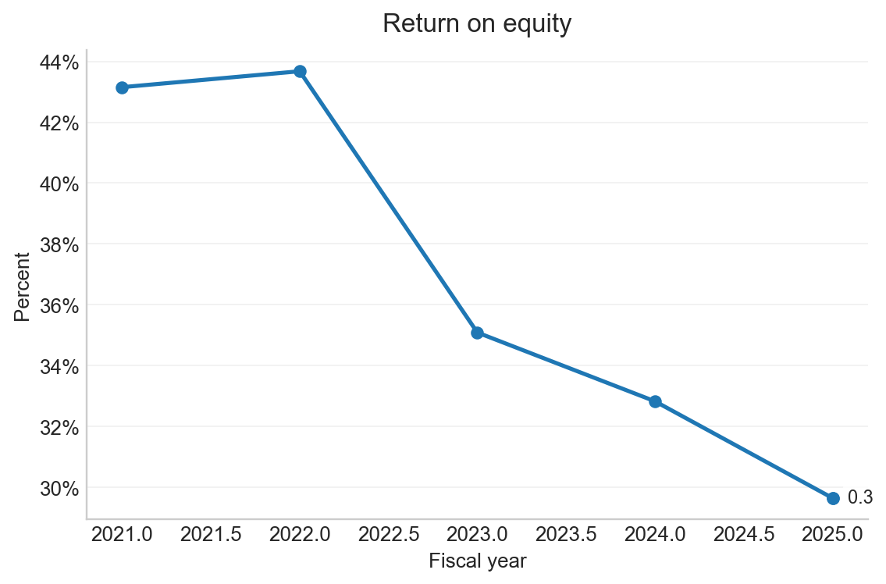

# MICROSOFT CORP - MSFT Automated Financial Analysis Report

- CIK: `0000789019`
- Generated: 2026-01-12 00:48:15
- Coverage: last 5 fiscal years

## Highlights
- Latest fiscal year: **FY2025** ended 2025-06-30.
- Revenue: **281.7B** and 14.9% YoY.
- Gross margin: **68.8%**.
- Operating margin: **45.6%**.
- Net margin: **36.1%**.
- Free cash flow: **71.6B** and 25.4% of revenue.
- Revenue increased vs prior year.

## Charts

| | |
|---|---|
| <b>Revenue</b>  | <b>Revenue YoY</b>  |
| <b>Margins</b>  | <b>Cash flow</b>  |
| <b>Income statement levels</b>  | <b>Balance sheet snapshot</b>  |
| <b>Cash flow quality</b>  | <b>Return on equity</b>  |

## Annual Financials Table
USD in billions for level metrics
|   fy | fiscal_year_end   |   revenue |   gross_profit |   operating_income |   net_income |   cfo |   capex |   fcf | revenue_yoy   | gross_margin   | operating_margin   | net_margin   | fcf_margin   |   cash |   equity |
|-----:|:------------------|----------:|---------------:|-------------------:|-------------:|------:|--------:|------:|:--------------|:---------------|:-------------------|:-------------|:-------------|-------:|---------:|
| 2025 | 2025-06-30        |     281.7 |          193.9 |              128.5 |        101.8 | 136.2 |    64.6 |  71.6 | 14.9%         | 68.8%          | 45.6%              | 36.1%        | 25.4%        |   30.2 |    343.5 |
| 2024 | 2024-06-30        |     245.1 |          171   |              109.4 |         88.1 | 118.5 |    44.5 |  74.1 | 15.7%         | 69.8%          | 44.6%              | 36.0%        | 30.2%        |   18.3 |    268.5 |
| 2023 | 2023-06-30        |     211.9 |          146.1 |               88.5 |         72.4 |  87.6 |    28.1 |  59.5 | 6.9%          | 68.9%          | 41.8%              | 34.1%        | 28.1%        |   34.7 |    206.2 |
| 2022 | 2022-06-30        |     198.3 |          135.6 |               83.4 |         72.7 |  89   |    23.9 |  65.1 | 18.0%         | 68.4%          | 42.1%              | 36.7%        | 32.9%        |   13.9 |    166.5 |
| 2021 | 2021-06-30        |     168.1 |          115.9 |               69.9 |         61.3 |  76.7 |    20.6 |  56.1 | NA            | 68.9%          | 41.6%              | 36.5%        | 33.4%        |   14.2 |    142   |

## XBRL Concept Map

| Metric | XBRL Concept |
|---|---|
| revenue | `RevenueFromContractWithCustomerExcludingAssessedTax` |
| gross_profit | `GrossProfit` |
| operating_income | `OperatingIncomeLoss` |
| net_income | `NetIncomeLoss` |
| cfo | `NetCashProvidedByUsedInOperatingActivities` |
| capex | `PaymentsToAcquirePropertyPlantAndEquipment` |
| cash | `CashAndCashEquivalentsAtCarryingValue` |
| equity | `StockholdersEquity` |
