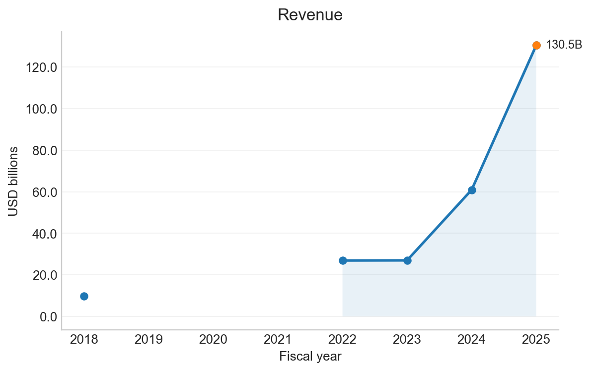
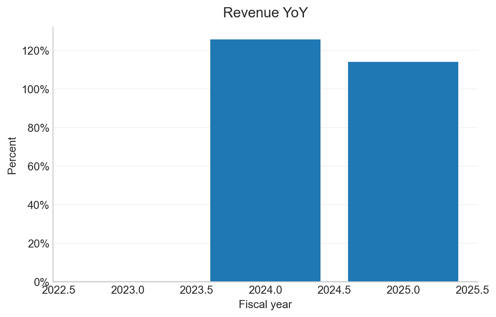
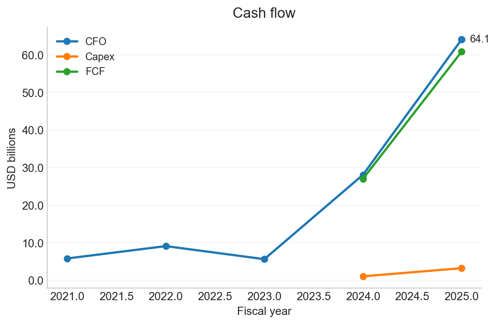
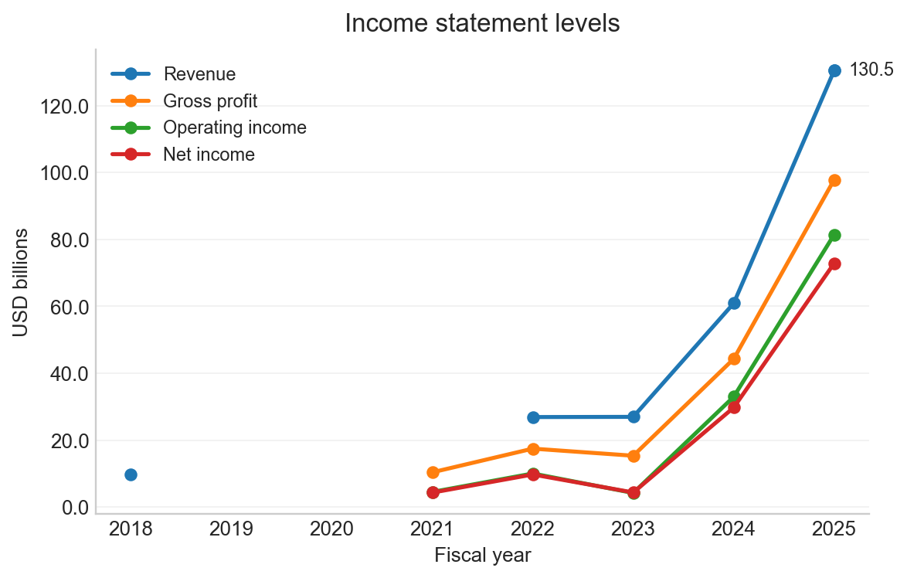
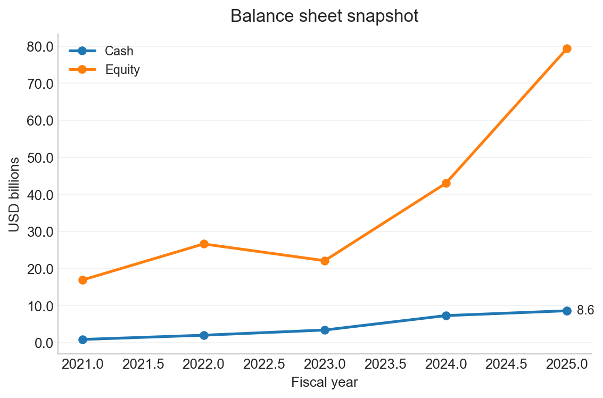
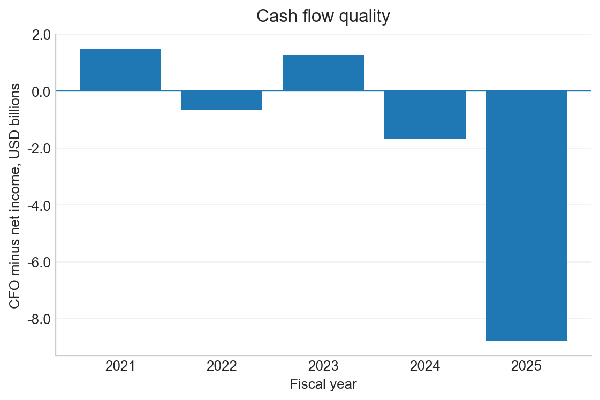
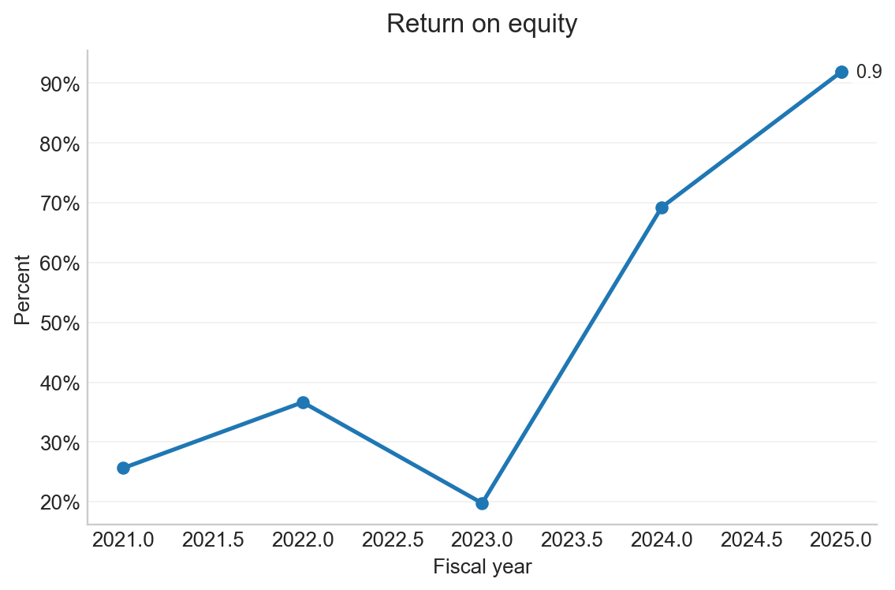

# NVIDIA CORP - NVDA Automated Financial Analysis Report

- CIK: `0001045810`
- Generated: 2026-01-12 00:48:16
- Coverage: last 5 fiscal years

## Highlights
- Latest fiscal year: **FY2025** ended 2025-01-26.
- Revenue: **130.5B** and 114.2% YoY.
- Gross margin: **75.0%**.
- Operating margin: **62.4%**.
- Net margin: **55.8%**.
- Free cash flow: **60.9B** and 46.6% of revenue.
- Revenue increased vs prior year.

## Charts

| | |
|---|---|
| <b>Revenue</b>  | <b>Revenue YoY</b>  |
| <b>Margins</b>  | <b>Cash flow</b>  |
| <b>Income statement levels</b>  | <b>Balance sheet snapshot</b>  |
| <b>Cash flow quality</b>  | <b>Return on equity</b>  |

## Annual Financials Table
USD in billions for level metrics
|   fy | fiscal_year_end   | revenue   | gross_profit   | operating_income   | net_income   | cfo   | capex   | fcf   | revenue_yoy   | gross_margin   | operating_margin   | net_margin   | fcf_margin   | cash   | equity   |
|-----:|:------------------|:----------|:---------------|:-------------------|:-------------|:------|:--------|:------|:--------------|:---------------|:-------------------|:-------------|:-------------|:-------|:---------|
| 2025 | 2025-01-26        | 130.5     | 97.9           | 81.5               | 72.9         | 64.1  | 3.2     | 60.9  | 114.2%        | 75.0%          | 62.4%              | 55.8%        | 46.6%        | 8.6    | 79.3     |
| 2024 | 2024-01-28        | 60.9      | 44.3           | 33.0               | 29.8         | 28.1  | 1.1     | 27.0  | 125.9%        | 72.7%          | 54.1%              | 48.8%        | 44.4%        | 7.3    | 43.0     |
| 2023 | 2023-01-29        | 27.0      | 15.4           | 4.2                | 4.4          | 5.6   | NA      | NA    | 0.2%          | 56.9%          | 15.7%              | 16.2%        | NA           | 3.4    | 22.1     |
| 2022 | 2022-01-30        | 26.9      | 17.5           | 10.0               | 9.8          | 9.1   | NA      | NA    | NA            | 64.9%          | 37.3%              | 36.2%        | NA           | 2.0    | 26.6     |
| 2021 | 2021-01-31        | NA        | 10.4           | 4.5                | 4.3          | 5.8   | NA      | NA    | NA            | NA             | NA                 | NA           | NA           | 0.8    | 16.9     |
| 2018 | 2018-01-28        | 9.7       | NA             | NA                 | NA           | NA    | NA      | NA    | NA            | NA             | NA                 | NA           | NA           | NA     | NA       |

## XBRL Concept Map

| Metric | XBRL Concept |
|---|---|
| revenue | `Revenues` |
| gross_profit | `GrossProfit` |
| operating_income | `OperatingIncomeLoss` |
| net_income | `NetIncomeLoss` |
| cfo | `NetCashProvidedByUsedInOperatingActivities` |
| capex | `PaymentsToAcquireProductiveAssets` |
| cash | `CashAndCashEquivalentsAtCarryingValue` |
| equity | `StockholdersEquity` |
